# Adversarial Autoencoder
University of Freiburg

This project was developed as part of Deep Learning course.

It contains tensorflow implementation of [Adversarial Autoencoder](https://arxiv.org/abs/1511.05644).

Adversarial Autoencoder is a little bit different than standard autoencoder. Plain autoencoder takes its input and forwards it through neural network creating latent representation (Let's call it 'z'). Usually dimensionality of 'z' is smaller than dimensionality of input, this way network needs to learn meaningfull representations. Latent representation has to carry usefull information needed to recover image. Second part of network, decoder takes this representation and tries to recover original input. In standard autoencoder we don't care what range of values 'z' takes, so optimization procedure will span 'z' as it finds it best to minimize it's training loss. Distribution will be formed from encoded training samples (set of Enc(x) for all training x) and it can take arbitrary shape.

Adversarial Autoencoder puts additional constraint on 'z'. We force encoder to map input 'x' to distribution of our choice. This way we can later sample or traverse this distribution and generate reconstructions. Turns out that we can interpret moving in latent space as adding/removing features from reconstruction.

Image from original paper

To achieve our goal we introduce additional neural network, discriminator that will take 'z' produced by encoder and 'z' sampled from desired distribution as input, we will train it to make correct predictions about source distribution. Using gradients from discriminator we will additionaly train encoder so it learns how to fool discriminator in addition to producing meaningful representation of 'z' needed by decoder. We will try to keep different optimization objectives in ballance, mainly we will stop discriminator from training if it gets to good until encoder catches up. 

## Enviroment

- Python 3.5.2
- TensorFlow 0.12.1

## Scenarios

In all experiments batch norm is used both in encoder and decoder network, discriminator network does not use batch norm. Leaky ReLU with 0.2 leak was chosen as an activation. Odd scenario number indicates that network was trained using additional data, for MNIST it means that vector with latent representation was concatenated with y label (One hot  encoded) before it was feed into decoder and discriminator. Every model uses the same discrimination network, 2 hidden layers with 500 neurons in each, output with one sigmoid unit. Gaussian normal distribution with 0 mean and unit variance is used to sample from latent space with constraint that samples have maximum magnitude of 2 standard deviations. 

Adam optimizer was used for training with learning rate of 0.0002. When no further improvement
was observed learning rate was divided by 5 and training was continued. Additionally training
of discriminator was allowed only when encoder was not performing to badly and vice versa.

By default images from Mnist dataset are compressed to 5 dimensions, images from Celeb 32x32
dataset are compressed to 50 dimensions. 

### 1,2 Autoencoder is trained on MNIST data using network with fully connected layers. 

Animations created by sampling latent variables from uniform grid in 4 dimensions, 5th dimension
is represented as time.

(Note: Not all browsers support .apng format. Hint: Use firefox)

Traversing dimension z_3 with different class labels (Network from scenario 1):

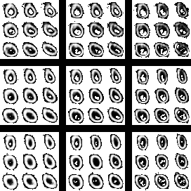 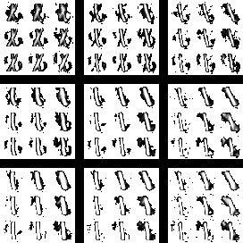 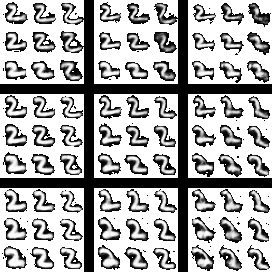 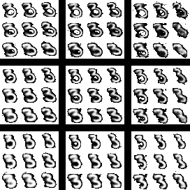 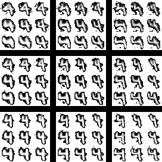 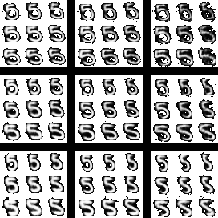 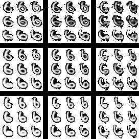 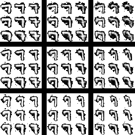 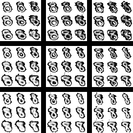 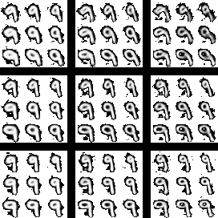

Images preserve "style" after changing class label (Network from scenario 1):

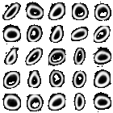 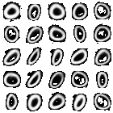 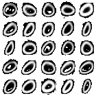

Traversing through different dimensions of latent representation (Network from scenario 2):

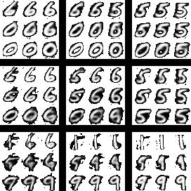 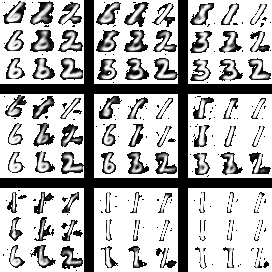 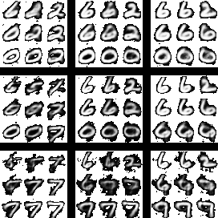 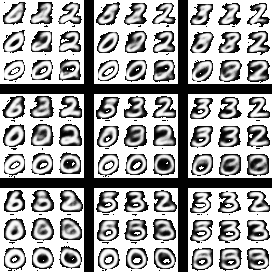 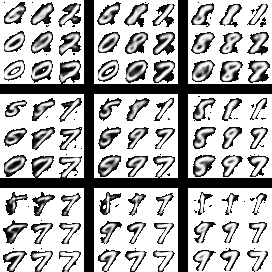 

3. 4. Same as scenario 1 but we use convolutional neural network in both encoder 
and decoder. 

Encoder: 

    3x3x16 convolution
    4x4x32 convolution with stride 2
    4x4x64 convolution with stride 2
    7x7x5 convolution to reduce representation to 5 dimensions
    
Decoder:

    7x7x64 transposed convolution
    4x4x32 transposed convolution with stride 2
    4x4x16 transposed convolution with stride 2
    3x3x1  convolution

## References

- [DCGAN Tensorflow code](https://github.com/carpedm20/DCGAN-tensorflow)
- TODO: Add papers

## License

MIT License.
