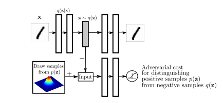
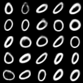
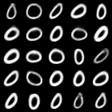
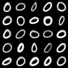

# Adversarial Autoencoder
University of Freiburg

Deep Learning Lab final project

Tensorflow implementation of [Adversarial Autoencoder](https://arxiv.org/abs/1511.05644).

## Enviroment

- Python 3.5.2
- TensorFlow 0.12.1

(TODO: Add AAE description)

## Scenarios

In all experiments batch norm is used both in encoder and decoder network, discriminator
network does not use batch norm. Leaky ReLU with 0.2 leak was chosen as an activation.
Odd scenario number indicates that network was trained using additional data, for MNIST
it means that vector with latent representation was concatenated with y label (One hot 
encoded) before it was feed into decoder and discriminator. Every model uses the same
discrimination network, 2 hidden layers with 500 neurons in each, output with one sigmoid
unit. Gaussian normal distribution with 0 mean and unit variance is used to sample from 
latent space with constraint that samples have maximum magnitude of 2 standard deviations. 

Adam optimizer was used for training with learning rate of 0.0002. When no further improvement
was observed learning rate was divided by 5 and training was continued. Additionally training
of discriminator was allowed only when encoder was not performing to badly and vice versa.

By default images from Mnist dataset are compressed to 5 dimensions, images from Celeb 32x32
dataset are compressed to 50 dimensions. 

### 1,2 Autoencoder is trained on MNIST data using network with fully connected layers. 

Animations created by sampling latent variables from uniform grid in 4 dimensions, 5th dimension
is represented as time. First two images come from scenario 1, and are conditioned by y variable 
(4 and 8 in this case), third image comes from scenario 3
(Note: Not all browsers support .apng format)

Images preserve "style" after applying changing conditioning label.

  

3. 4. Same as scenario 1 but we use convolutional neural network in both encoder 
and decoder. 

Encoder: 

    3x3x16 convolution
    4x4x32 convolution with stride 2
    4x4x64 convolution with stride 2
    7x7x5 convolution to reduce representation to 5 dimensions
    
Decoder:

    7x7x64 transposed convolution
    4x4x32 transposed convolution with stride 2
    4x4x16 transposed convolution with stride 2
    3x3x1  convolution

## References

- [DCGAN Tensorflow code](https://github.com/carpedm20/DCGAN-tensorflow)
- TODO: Add papers

## License

MIT License.
